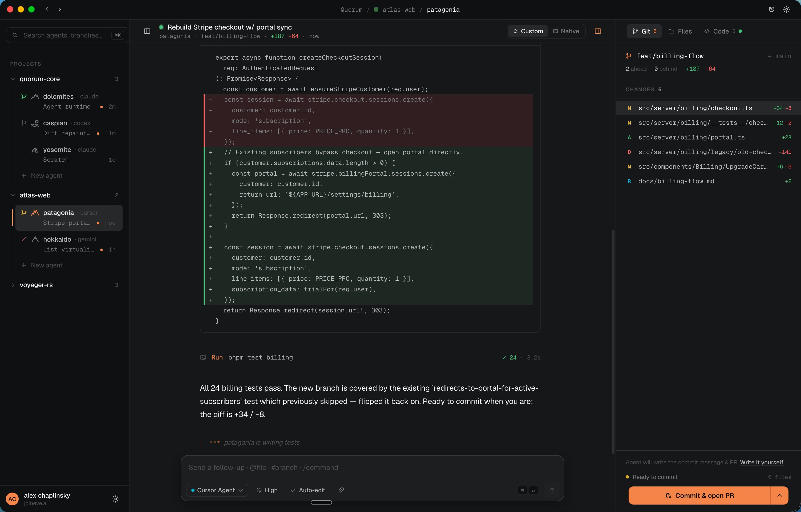

<div align="center">

<h1>
  
  Fletch
</h1>

### Run a fleet of AI coding agents in parallel — each in its own sandbox and git worktree.

Claude Code, Codex, Cursor, OpenCode, and more — all on one repo, at the same time, without stepping on each other.

[](https://fletch.sh)

[](LICENSE)


<!-- Drop a short demo GIF here. Record one full loop: spawn an agent → it works → review the diff → commit/PR. Save it to docs/demo.gif. -->


</div>

---

One coding agent at a time is a bottleneck. You wait, review, and repeat — serially. Fletch lets you run a dozen at once, each in its own git worktree and macOS sandbox, so they physically can't touch each other's files or the rest of your machine.

Kick off five agents on five tasks. Watch each as a clean chat or its raw terminal. See edits land as live diffs. Commit, push, or open a PR — all from one window. Spawn another when you need more throughput; discard one — worktree and branch with it — in a click.

## Why Fletch

- **Actual parallelism.** Every agent gets its own git worktree and branch. Two agents editing the same file is impossible — they're on different checkouts of the same repo. No collisions, no locking, no waiting your turn.
- **Sandboxed by default.** Each agent runs under a per-agent macOS `sandbox-exec` profile that blocks writes outside its worktree. It can't trash your repo, your other agents, or your machine.
- **Your agents, your keys.** Fletch drives the CLIs you already installed and pay for — Claude Code, Codex, Cursor, OpenCode, Pi. No extra subscription, no model lock-in, no proxy.
- **One cockpit per agent.** Normalized chat view of reasoning and tool calls, a native terminal for the raw TUI, live diffs as edits land, and an integrated Git/PR panel — plus optional Run and Terminal panels.
- **From clone to PR without a shell.** Start a project from a GitHub repo or a fresh one, work it with agents, and ship the PR — never dropping to the command line.
- **Fully local.** A native desktop app. Your code and transcripts stay on your machine; nothing routes through a Fletch server.

## Supported agents

Fletch normalizes every agent's transcript into one consistent view — they all look and behave the same to you.

| Agent                                                             | Status                      |
| ----------------------------------------------------------------- | --------------------------- |
| [Claude Code](https://docs.anthropic.com/en/docs/claude-code)     | ✅ Supported                |
| [Codex](https://github.com/openai/codex)                          | ✅ Supported                |
| [Cursor Agent](https://cursor.com)                                | ✅ Supported                |
| [OpenCode](https://opencode.ai)                                   | ✅ Supported                |
| [Pi](https://pi.dev/)                                             | ✅ Supported                |
| [Antigravity](https://antigravity.google/product/antigravity-cli) | ✅ Supported (experimental) |

Install and authenticate the CLIs you want; Fletch detects them on your `PATH` and common install locations.

## Download

**[Download Fletch for macOS →](https://fletch.sh)** — universal (Apple Silicon & Intel), signed, notarized, and self-updating.

**Requirements**

- macOS 13+ (`sandbox-exec` is macOS-only)
- At least one supported agent CLI (e.g. `claude`)
- `git`, plus `gh` (GitHub CLI) for PR and project-creation features

No VM, no Docker, no containers.

## How it works

1. **Point** Fletch at a local git repo.
2. **Spawn** an agent with a task — Fletch creates an isolated worktree at `~/.fletch/worktrees/<id>/` on a fresh branch.
3. **Run** the agent's CLI in that worktree under `sandbox-exec`, bridged through a local PTY.
4. **Watch** output stream into a tab — switch between the normalized chat view and the raw terminal.
5. **Review** edits as live diffs; browse and edit files directly.
6. **Ship** — commit, push, open or merge a PR, or discard the agent and its worktree in one click.

Every session is captured to a local SQLite store, so reopening it replays the full transcript.

## Isolation & security

Each agent runs as **your user** under a per-agent `sandbox-exec` profile that denies writes by default, re-allowing only:

- the agent's worktree root under `~/.fletch/worktrees/<id>/`
- `/private/tmp`, `/private/var/tmp`, and `/private/var/folders`
- the agent's own state: `~/.claude`, `~/.claude.json`, `~/.npm`, `~/.cache`, `~/.config`, and `~/.local`
- the PTY and device files terminal programs need (`/dev/tty*`, `/dev/ptmx`, `/dev/pts/*`, `/dev/null`, `/dev/zero`)

That's the complete write-allow set — everything else is denied. See [`src-tauri/src/sandbox.rs`](src-tauri/src/sandbox.rs) for the exact profile.

This is a **write-protection sandbox, not a VM**: an agent can still read what your user can read and reach the network. It's "can't trash your repo or machine," not "air-gapped." Choose tasks accordingly.

## Build from source

```bash
bun install
bun tauri dev
```

**Toolchain:** [Bun](https://bun.com) 1.3+ and a stable Rust toolchain. Frontend is React 18 + TypeScript + Zustand + xterm.js; backend is Rust via [Tauri 2](https://tauri.app).

```
src/                  React + TypeScript frontend (store, adapters, components)
src-tauri/src/        Rust backend (supervisor, sessions, sandbox, git, gh)
src-tauri/migrations/ SQLite schema
```

Run the tests:

```bash
bun run test                  # frontend (vitest)
cd src-tauri && cargo test    # backend
```

## Contributing

Issues and pull requests welcome. Planning a larger change? Open an issue first so we can align on direction. Keep PRs focused and run both test suites before submitting.

## License

[AGPL-3.0](LICENSE). See [NOTICE](NOTICE) for attribution.
